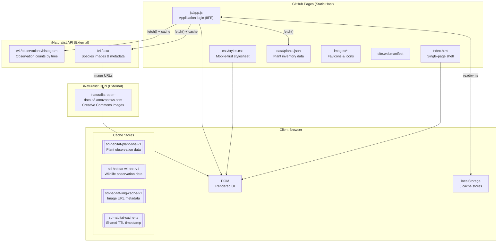
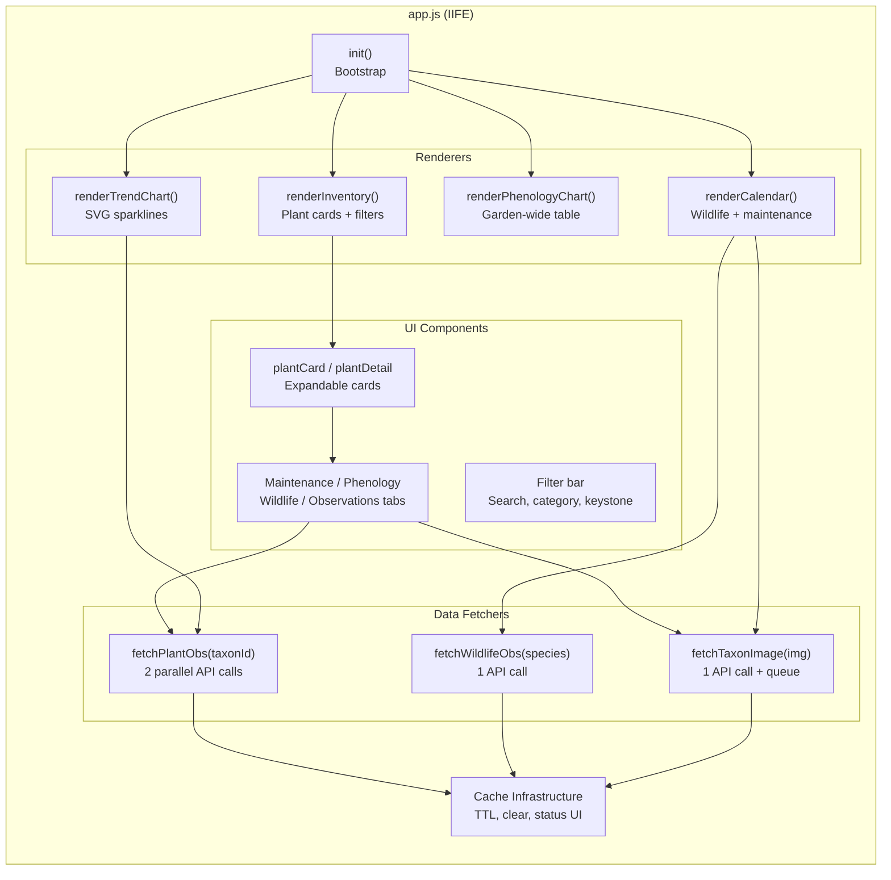
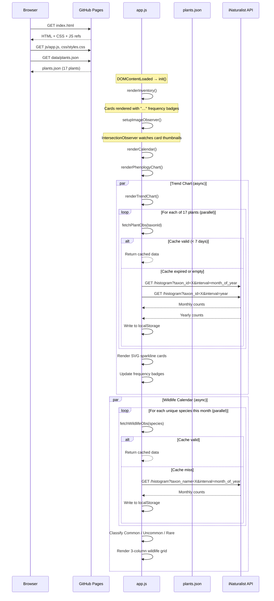
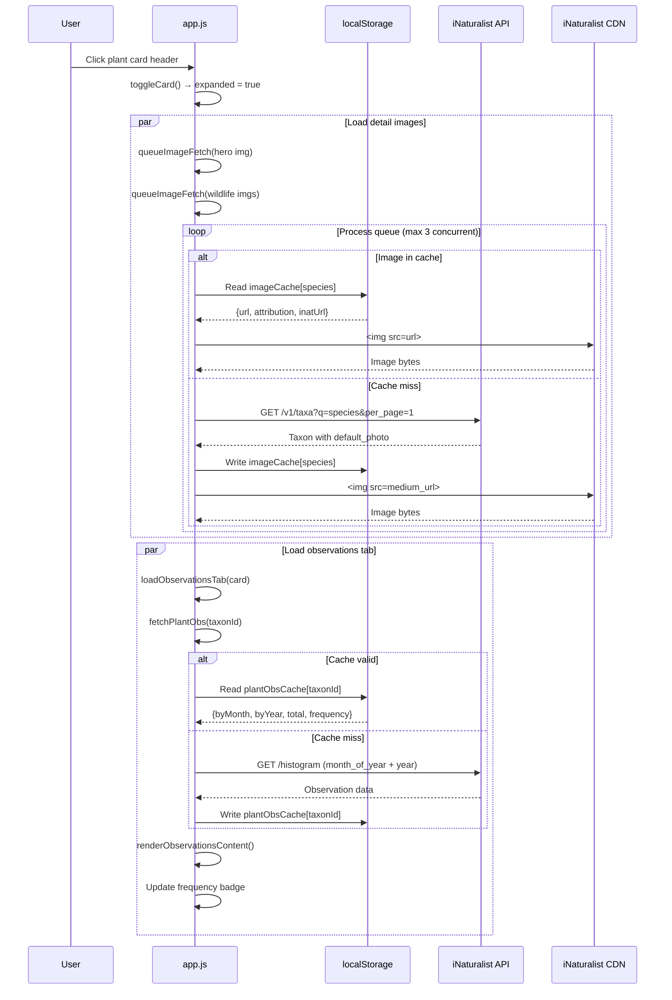
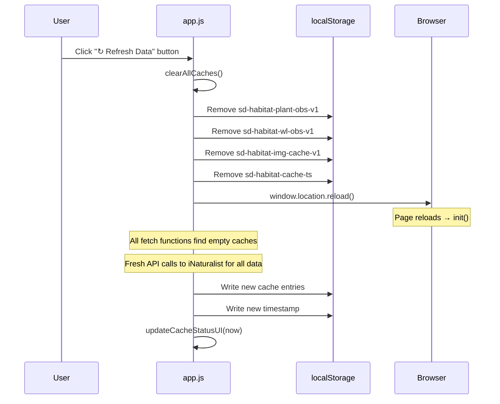

# SD Native Habitat Garden — Technical Design Document

**Project:** Sunny Desai Native Habitat Garden — Poway, CA
**Version:** 1.0
**Last Updated:** 2026-04-14

---

## 1. Problem Statement

### Problem

Habitat gardens planted with California native species generate a complex web of time-varying information: which plants bloom when, what wildlife visits each month, how to water and prune on the right schedule, and whether citizen-science observations confirm the garden's ecological value. This information lives in field guides, Calscape pages, iNaturalist records, and the gardener's memory — scattered across sources and difficult to act on in the moment.

### Value

A single, data-driven reference site consolidates all of this into one place:

- **For the gardener:** A month-by-month dashboard answers "what should I do this week?" and "what wildlife should I look for?" without cross-referencing multiple sources.
- **For conservation:** Integrating live iNaturalist observation data quantifies the garden's contribution to local biodiversity in the Poway area, one of the last fragments of Southern California's endangered coastal sage scrub ecosystem.
- **For the community:** An open-source, no-cost, no-login site can inspire neighbors to plant native gardens and contribute to a wildlife corridor.

---

## 2. Functional Requirements

Derived from the [Product Requirements Document](PRD.md) §3.

| ID | Requirement | Implementation |
|---|---|---|
| FR-1 | **Plant inventory** with 17 species, each displaying common/scientific names, images, descriptions, keystone badge, category, planting requirements, and links to Calscape/iNaturalist | Single-page app renders `data/plants.json` into expandable card components grouped by category. Cards are filterable by category, keystone status, and free-text search. |
| FR-2 | **Maintenance schedule** per plant showing 12-month watering frequency and pruning tasks | Per-plant tab with two 6×2 grids (watering cells color-coded by frequency, pruning cells with scissor indicators). Current month highlighted. |
| FR-3 | **Bloom, berry & seed phenology** with actual botanical colors | Per-plant tab with 12-month color-coded cells (CSS gradients for multi-color blooms, stripe pattern for seeds, dot overlay for berries). Garden-wide phenology chart as a scrollable HTML table with sticky plant-name column. |
| FR-4 | **Wildlife schedule** per plant with specific named species, activity type, and month ranges | Per-plant tab listing each species with image, activity label, 12-month indicator grid, and notes. Images fetched at runtime from iNaturalist taxa API. |
| FR-5 | **Garden Calendar** showing garden-wide monthly summary | Month-navigable dashboard with three sub-sections: wildlife (deduplicated by species, classified Common/Uncommon/Rare), maintenance (two-column: watering and pruning), and observation trends (SVG sparkline cards). |
| FR-6 | **Observation data** for each plant showing monthly histograms and year-over-year trends | Fetched at runtime from iNaturalist histogram API. Displayed in per-plant Observations tab and garden-wide trend chart. Frequency badge (common/uncommon/rare) derived from 5-year total. |
| FR-7 | **Wildlife rarity classification** using live observation counts | For each unique wildlife species in the current calendar month, the site fetches monthly observation data from iNaturalist, then classifies species into Common/Uncommon/Rare using percentile-based thresholds calculated dynamically from the current month's data. |
| FR-8 | **Cache management** with manual refresh | Footer displays cache timestamp and a "Refresh Data" button that clears all `localStorage` caches and reloads the page. |

---

## 3. Non-Functional Requirements

Derived from the [Product Requirements Document](PRD.md) §2.

| ID | Requirement | Implementation |
|---|---|---|
| NFR-1 | **Static hosting on GitHub Pages** — no server-side rendering | Entire site is HTML + CSS + JS + JSON. No build step, no server, no database. Deployed by pushing to `main` branch. |
| NFR-2 | **Performance: Lighthouse ≥ 90** across all categories | Page shell < 500 KB (excluding off-site images). Images lazy-loaded via `IntersectionObserver`. API calls parallelized and cached. CSS uses system font stack (no web font downloads). |
| NFR-3 | **Accessibility: WCAG AA** | Semantic HTML (`<nav>`, `<main>`, `<section>`, `<footer>`), ARIA landmarks and labels, keyboard-navigable cards (`tabindex`, `role="button"`, `aria-expanded`), skip link, sufficient color contrast, alt text on all images. |
| NFR-4 | **Responsive: 375px–1440px+** | Mobile-first CSS with breakpoints at 480px, 600px, and 768px. CSS Grid with `auto-fill`/`auto-fit` for fluid column counts. Hamburger menu on mobile. |
| NFR-5 | **SEO & social sharing** | `<title>`, `<meta description>`, Open Graph tags, Twitter Card tags, semantic heading hierarchy, favicon suite (SVG, PNG, ICO, Apple Touch Icon, Web App Manifest). |
| NFR-6 | **Data freshness with 7-day TTL** | All runtime-fetched data (plant observations, wildlife observations, species images) cached in `localStorage` with a shared timestamp. Cache expires after 7 days; expired entries are re-fetched on next access. |
| NFR-7 | **Graceful degradation** | If iNaturalist API is unavailable, the site falls back to stale cached data or shows placeholder states. Plant inventory, maintenance, phenology, and wildlife schedules all render from local JSON without any API dependency. |
| NFR-8 | **No external dependencies** | Zero npm packages, zero frameworks, zero CDN dependencies. Vanilla HTML/CSS/JS only. |

---

## 4. Assumptions & Considerations

| # | Constraint | Impact on Design |
|---|---|---|
| 1 | **GitHub Pages is static-only** — no server-side code, no environment variables, no scheduled jobs | All dynamic data (observation counts, species images) must be fetched client-side. There is no server to proxy API calls, enforce rate limits, or store secrets. The iNaturalist API is called directly from the browser. |
| 2 | **iNaturalist API has no authentication requirement** but informal rate limits (~1 req/sec recommended) | Plant observation fetches are parallelized in bulk (2 calls × 17 plants = 34 calls on first load of the trend chart). Wildlife observation fetches are parallelized per-month (up to ~15 unique species). Aggressive `localStorage` caching with a 7-day TTL minimizes repeat calls. |
| 3 | **iNaturalist CDN images are hotlinked** — no local copies | If iNaturalist changes image URLs or goes down, images break. Mitigated by caching resolved image URLs in `localStorage`. All images are Creative Commons licensed and properly attributed. |
| 4 | **`localStorage` has a ~5 MB quota** per origin | Three caches share this space: plant observations, wildlife observations, and image metadata. For 17 plants and ~40 wildlife species, total cached data is well under 1 MB. |
| 5 | **Single JSON file for all plant data** | With 17 plants, the file is ~30 KB (minified). If the inventory grows to hundreds of plants, the file may need splitting or lazy loading. Current size is not a concern. |
| 6 | **No build step** | All code is hand-written and committed as-is. No transpilation, minification, or bundling. This keeps the project simple but means no TypeScript, no JSX, and no tree-shaking. |
| 7 | **Poway bounding box is hardcoded** | The geographic scope (`nelat=33.0652649, nelng=-116.9575429, swlat=32.899128, swlng=-117.103013`) is baked into both the JavaScript and the iNaturalist search URLs in `plants.json`. Relocating the garden would require updating both. |
| 8 | **Browser must support ES2020+** | The app uses optional chaining (`?.`), `Promise.all`, `async/await`, `IntersectionObserver`, `Map`, `Set`, and template literals. Supported by all target browsers (latest 2 versions of Chrome, Safari, Firefox, Edge). |

---

## 5. Physical Component Diagram



### Module Breakdown (`js/app.js`)

The entire application is a single IIFE with the following logical modules:



---

## 6. Sequence Diagrams

### 6.1 Page Load & Initialization



### 6.2 Plant Card Expansion & Image Loading



### 6.3 Cache Refresh Flow



---

## 7. Data Flow Summary

```
┌─────────────────────────────────────────────────────────────┐
│                     data/plants.json                         │
│  (static: IDs, names, descriptions, phenology, wildlife,    │
│   maintenance schedules, taxonIds, searchUrls)               │
└────────────────────────┬────────────────────────────────────┘
                         │ fetch() on page load
                         ▼
┌─────────────────────────────────────────────────────────────┐
│                      js/app.js                               │
│                                                              │
│  ┌──────────┐  ┌──────────────┐  ┌────────────────────────┐ │
│  │ Inventory │  │ Phenology    │  │ Garden Calendar        │ │
│  │ (sync)    │  │ Chart (sync) │  │ Wildlife (async+cache) │ │
│  └──────────┘  └──────────────┘  │ Maint    (sync)        │ │
│                                   │ Trends   (async+cache) │ │
│  ┌──────────────────────┐        └────────────────────────┘ │
│  │ Per-plant tabs:       │                                   │
│  │  Maintenance (sync)   │         ┌──────────────────────┐ │
│  │  Phenology   (sync)   │         │ Image Queue          │ │
│  │  Wildlife    (sync)   │         │ (async, 3 concurrent)│ │
│  │  Observations(async)  │         └──────────────────────┘ │
│  └──────────────────────┘                                    │
└─────────────────────────────────────────────────────────────┘
                         │
          ┌──────────────┼──────────────┐
          ▼              ▼              ▼
   iNaturalist    iNaturalist    iNaturalist
   /histogram     /taxa          CDN images
   (obs data)     (image URLs)   (photo files)
          │              │              │
          └──────┬───────┘              │
                 ▼                      │
          localStorage                  │
          (7-day TTL)                   │
                 │                      │
                 └──────────┬───────────┘
                            ▼
                     Rendered DOM
```
